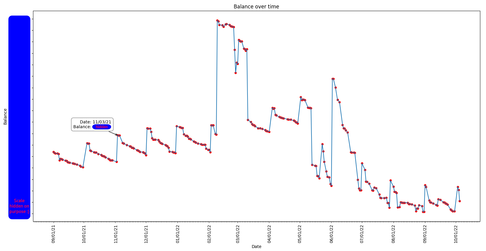

# Credit Agricole Analyzer

**DISCLAIMER : I AM NOT AFFILIATED TO THE CREDIT AGRICOLE IN ANY WAY, THIS IS AN UNOFFICIAL TOOL**

## Usage

```
$ ca-analyzer -h                                
usage: ca-analyzer [-h] [--country {france,italy,polska,ukraine,maroc,egypt}] [--region REGION]

Welcome to the Credit Agricole utility

options:
  -h, --help            show this help message and exit
  --country {france,italy,polska,ukraine,maroc,egypt}
                        the country you're in
  --region REGION       the region of the Credit Agricole you're affiliated to
```

Example :

```
$ ca-analyzer --country france --region aquitaine
User ID: 0013371337
Pin code: 

Welcome to the Credit Agricole Analyzer !

Available variables:
    - creditagricole : CreditAgricole instance
    - account : Account instance (your main account)
    - transactions_per_cat : dict of transactions sorted by category
    - balance_dataframe : pandas dataframe of the balance over time
    - plots : plotting facility

(This is an IPython shell, enjoy)
In [1]: 
```

## Plots

This tool allows you to visualize data through plots.

### Balance over time

```
In [1]: plots.balance_over_time()
```


